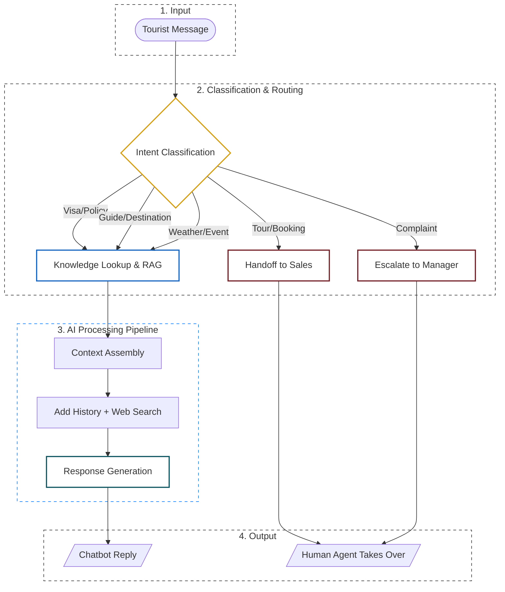

# 01 · Base Flow + Chốt 3 Knobs

> **Mục tiêu**: Hiểu chatbot hoạt động ra sao ở mức base (không chọn config gì) — và xác định 3 knobs nhóm sẽ tweak ở các bước sau.
>
> **Thời gian**: 7 phút (trong 15 phút phần Setup)

---

## Bước 1 — Đọc base flow trong cost reference card

Mở file `cost-reference-card.md` ở phần **2. Base Flow** — xem flow chatbot mặc định. Đây là cấu trúc mọi config sẽ build dựa trên.

Đọc xong, tự kiểm tra hiểu:

- Khi tourist gửi tin nhắn, AI làm gì đầu tiên?
- 5 intent dẫn đến 5 hành động khác nhau — hành động nào tốn LLM, hành động nào không?
- Sau khi route, AI ráp gì lại để generate response?

Nếu chưa hiểu → quay lại đọc lại 1 lần nữa. Đừng đi tiếp khi còn mơ hồ.

---

## Bước 2 — Vẽ lại flow theo cách hiểu của nhóm

Vẽ flow ra giấy hoặc trên bảng (1 thành viên vẽ, cả nhóm góp ý). Có thể dùng ASCII đơn giản:



Khi vẽ, đảm bảo flow có 4 điểm:

1. **Intent classification** — phân loại ý định
2. **Route theo intent** — 5 nhánh đi đâu (RAG / Web search / Handoff / Escalate)
3. **Context assembly** — ráp system prompt + history + RAG + web (nếu bật) + user msg
4. **Response generation** — model tạo câu trả lời

Nếu nhóm vẽ thiếu 1 trong 4 bước → bổ sung trước khi đi tiếp.

---

## Bước 3 — Xác định 3 Knobs

3 knobs là 3 quyết định thiết kế nhóm có thể tweak. Mỗi config nhóm thiết kế = 1 bộ chọn tại 3 knobs này.

Trước khi điền vào ô bên dưới, đọc nhanh mục **3. Decision Points** của `cost-reference-card.md`. Sau đó tự hỏi:

- Knob 1 — Model tier: model rẻ và model mạnh chênh bao nhiêu lần? Có thể mix theo intent không?
- Knob 2 — Web search: intent nào *cần* real-time? intent nào không cần?
- Knob 3 — History: 7 lượt chat cuối đắt hay rẻ? Cắt history có rủi ro gì?

### Knob 1 — Model tier

**Câu hỏi:** Chất lượng câu trả lời ở mức nào?

Options:

```text
□ Cheap        (Gemini Flash-Lite / DeepSeek V4 Flash / GPT-4o-mini)
□ Mid          (Gemini Flash / Claude Haiku 4.5)
□ Strong       (DeepSeek V4 Pro / Claude Sonnet 4.6)
□ Premium      (Claude Opus 4.7 / GPT-5.5)
☑ Mix          (model khác nhau cho intent khác nhau — viết rõ)
```

**Câu hỏi gợi mở cho nhóm** (trả lời trước khi chọn):

- Mục tiêu chính là chi phí thấp hay chất lượng cao?
- Tourist hỏi câu phức tạp hay đơn giản hơn?
- Có nên dùng cheap cho phân loại + strong cho trả lời không?

```text
Nhóm chọn Mix: Dùng model Cheap (Flash-Lite) để phân loại Intent vì task này đơn giản. 
Sau đó dùng Mid (Gemini Flash) cho Response Generation để đảm bảo chất lượng tư vấn Guide (45%) 
và độ chính xác cho Visa (15%). Điều này giúp tối ưu cost mà không hy sinh trải nghiệm.
```

### Knob 2 — Web search

**Câu hỏi:** Có cần thông tin real-time không?

Options:

```text
□ OFF              (chỉ dùng RAG — knowledge base có sẵn)
☑ ON selective    (bật cho 1–2 intent cần real-time: visa, weather)
□ ON broad         (bật cho hầu hết intent)
```

**Câu hỏi gợi mở:**

- Visa policy đổi mỗi tháng — RAG có đủ không?
- Weather là thông tin real-time tự nhiên — không có lựa chọn khác đúng không?
- Web search tốn $0.005/call + 800 tokens — bật bừa có lợi không?

```text
Chọn ON selective. Chỉ bật Web Search cho intent Visa/Policy và Weather/Event. 
Các thông tin về Destination/Guide có thể dùng RAG từ knowledge base của công ty 
để tiết kiệm chi phí search fee ($0.005) và token input.
```

### Knob 3 — History management

**Câu hỏi:** Chatbot cần nhớ bao nhiêu context của conversation?

Options:

```text
□ Last 3 turns        (nhẹ nhất, dễ quên)
☑ Last 5 turns        (cân bằng)
□ Full history        (nhớ tất cả, đắt nhất ở conv dài)
□ Summarize every 5   (nâng cao — cần 1 LLM call phụ để tóm tắt)
```

**Câu hỏi gợi mở:**

- Tourist hay nói "tôi đã nói budget là $500 ở turn 1" rồi turn 7 hỏi gợi ý — nếu quên thì sao?
- Scenario A trung bình 4 lượt → full history có tốn nhiều không?
- Scenario B trung bình 7 lượt → mỗi turn thêm 260 tokens — tổng thêm bao nhiêu?

```text
Chọn Last 5 turns. Với Scenario A (4 lượt), nó tương đương Full History. 
Với Scenario B (7 lượt), nó giúp giữ được ngữ cảnh quan trọng mà không làm 
token input phình to quá mức ở những lượt cuối, tránh lãng phí cost.
```

---

## Bước 4 — Sơ bộ nhóm muốn thử những combo nào?

Chưa cần quyết định cuối cùng. Chỉ cần phác thảo: nhóm dự định thử ít nhất 3 combo khác nhau. Càng khác nhau, càng dễ thấy tradeoff.

**Combo 1 (định hướng cheap)**:

```text
Model: Cheap (Flash-Lite)    Web: OFF    History: Last 3 turns    (đặt tên dự kiến: Economy Explorer)
```

**Combo 2 (định hướng premium)**:

```text
Model: Strong (Sonnet 4.6)    Web: ON broad    History: Full history    (đặt tên dự kiến: Luxury Concierge)
```

**Combo 3 (định hướng balanced / smart mix)**:

```text
Model: Mix (Lite/Flash)    Web: ON selective    History: Last 5 turns    (đặt tên dự kiến: Smart Nomad)
```

**Combo 4** (optional — nếu nhóm có ý tưởng khác):

```text
Model: Mid (Flash)    Web: ON selective    History: Full history    (đặt tên dự kiến: Deep Knowledge)
```

---

## Bảng kiểm trước khi sang file tiếp theo

- [x] Đã vẽ flow base có đủ 4 bước (Intent → Route → Context → Response)
- [x] Hiểu Booking + Khiếu nại = $0 LLM cost (chuyển con người)
- [x] Đã phác thảo ≥3 combo khác nhau (chưa cần chi tiết)
- [x] Nhóm đồng thuận về hướng đi mỗi combo

Xong → 10:25 chuyển sang **Main phase**. Mở `02-config-design.md`.
